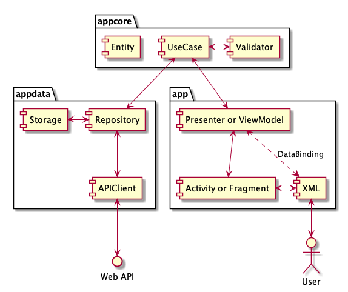

# XAppRecipe(Android)
## Quick Start
* [Android Studio]
* [Node.js]
  * ```ionic``` (by [IonicCLI])
  * ```yarn```

If you can use above commands, please run these commands.

1. ```yarn install```
2. ```ionic build```
3. ```ionic capacitor sync```
4. ```ionic capacitor open android```


## Memo
### Architecture
The basic structure is MV*(P or VM) and their additions.

* Atomic Design
* Clean Architecture
* Data Binding
* Repository Pattern



module | Atomic Design | Clean Architecture | MV(P or VM) | note
--- | :---: | :---: | --- | ---
app | x | outer | V, *(P or VM) | UI logic
app/atoms | atoms | outer | V |  |
app/molecules | molecules | outer | V |  |
app/organisms | organisms | outer | V |  |
app/pages | pages | outer | V, *(P or VM) |  |
app/templates | templates | outer | V |  |
appcore | x | inner | M |  |
appcore/entities | x | inner | M | Data structure definition
appcore/usecases | x | inner | M | Definition of how to use the app
appcore/validator | x | inner | M |  |
appdata | x | outer | M |  |
appdata/api | x | outer | M |  |
appdata/repositories | x | outer | M |  |
appdata/storage | x | outer | M |  |

### Libraries
Please check [build.gradle](./app/build.gradle) for details.

* [Android Jetpack]
* [AndroidPreparation]
* [Kotlin Coroutines]
* [Material Components]


[Android Studio]: https://developer.android.com/studio?hl=ja
[Android Jetpack]: https://developer.android.com/jetpack?hl=ja
[AndroidPreparation]: https://github.com/TentaShion/AndroidPreparation
[IonicCLI]: https://ionicframework.com/
[Kotlin Coroutines]: https://kotlinlang.org/docs/reference/coroutines-overview.html
[Material Components]: https://material.io/develop/android
[Node.js]: https://nodejs.org/
